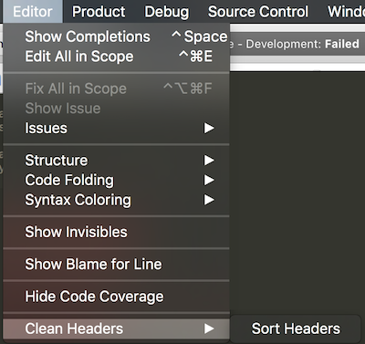

# CleanHeaders

An Xcode plug-in to format your import headers in a systematic manner. It simply removes duplicates, spaces and sorts them alphabetically making it much more easier to read and avoid duplicate imports. Works with `@imports`, `#include`, `#import` and `import`.

## Usage

Select the option from `Editor > Clean Headers > Sort Headers`. You can add shortcuts from Xcode preferences.

## TODO/Limitations

- Missing tests

## Support for Alcatraz (Deprecated)

Install the older version[v1.0.0](https://github.com/insanoid/CleanHeaders-Xcode/releases/tag/v1.0.0).

Alternatively you can also clone the release, build and run CleanHeaders, restart Xcode.

## Credits

I am using some helper functions to deal with the filtering out source text from[xTextHandler-objc](https://github.com/cyanzhong/xTextHandler-objc), thanks for the awesome class.), thanks for the awesome class.), thanks for the awesome class.
